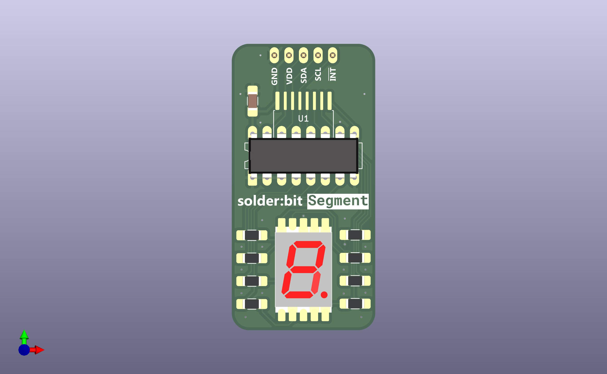

# Changelog for solder:bit Segment

Each version captures specific changes categorized under "Added", "Changed", "Removed", and "Fixed" to provide an overview of the development progression.

## v0.2

For this version, the plan is to implement the following:

1. Add J1 designator on the silkscreen for the header pins
2. Make the QR code on the back smaller, and consider the new format more in line with Devices Lab
3. Route the address pins on the I/O expanders so that both packages end up with the same I2C address.

## v0.1

### Added

- First version of the PCB
