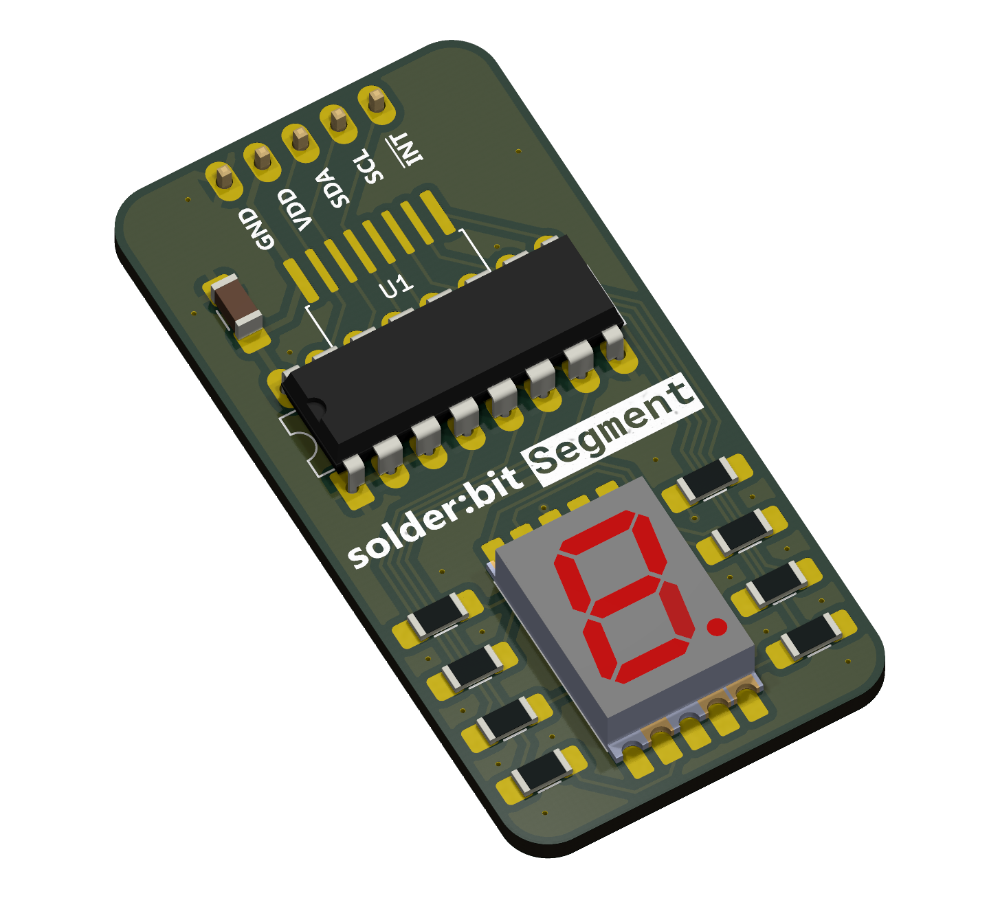

# solder:bit Segment

- I/O expander PCF8574 (DIP-16 package) [Onecall= 3124747]
- I/O expander PCF8574 (SO-16 package) [Onecall = 2776146]
- 7-segment display VDMR10A0 [Onecall = 2682708]
- Row of 5 male header pins, 2.54 mm [Onecall = CN14490]

| I/O expander in an SO-16 package (SMT)       | I/O expander in a DIP-16 package (THT)       |
| -------------------------------------------- | -------------------------------------------- |
|  |  |

## Programming

You can program the solder:bit Segment in [MakeCode](https://makecode.microbit.org/) using the [pxt-solderbit-segment](https://github.com/devices-lab/pxt-solderbit-segment) extension.

You can test if your assembled device works by flashing the micro:bit with the [demo file](/demo/microbit-solderbit-segment-demo.hex). Attach the micro:bit to a breadboard with an [adaptor](https://kitronik.co.uk/products/5664-microbit-breadboard-breakout-board), and wire up GND to GND, VDD to 3V, SDA to P20, and SCL to P19 (see this [image](/demo/wiring_front.jpeg)).

## Project status

This project is actively maintained. See [CHANGELOG.md](/CHANGELOG.md) for the latest changes.

## Credits

Special thanks to everyone at the Lancaster University [Devices Lab](https://www.devices-lab.org/).

## License

This project is licensed under the GNU General Public License (GPL), version 3. This license allows you to use, modify, and redistribute the solder:bit Segment and any derivative works, but all such derivatives must also be licensed under the GPL.

The GPL ensures that all modifications and improvements to the solder:bit Segment remain free and open for the public benefit. By using this project, you agree to abide by its terms and conditions.

For more details on the license, please see the [LICENSE](/LICENSE) file included in this repository.

  

