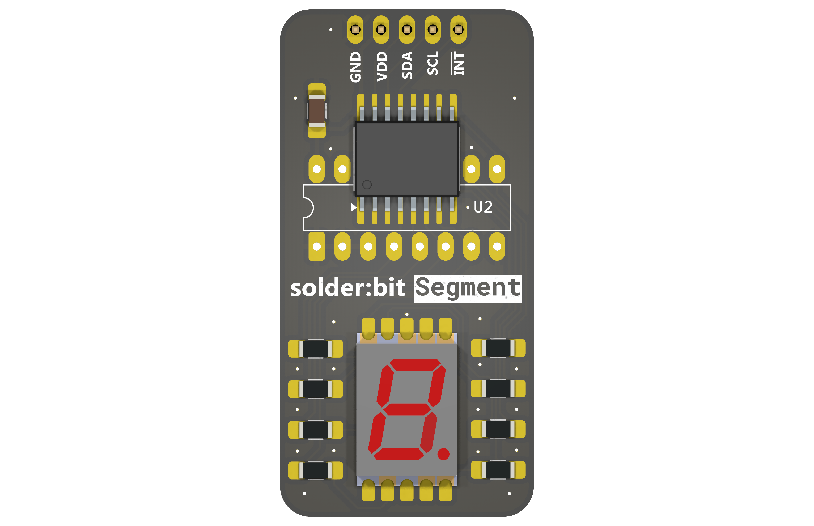
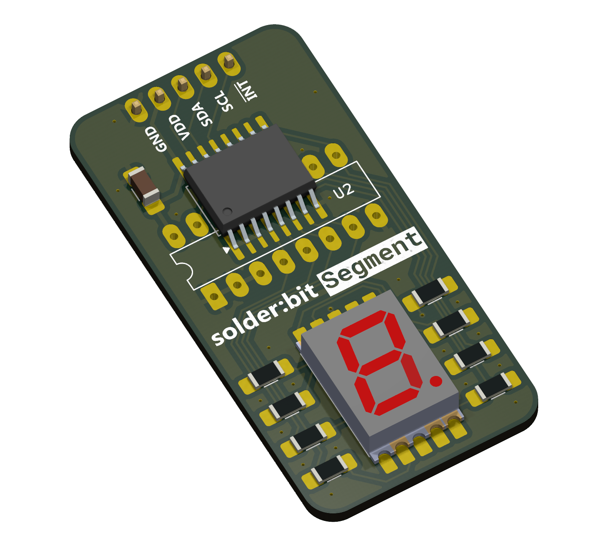
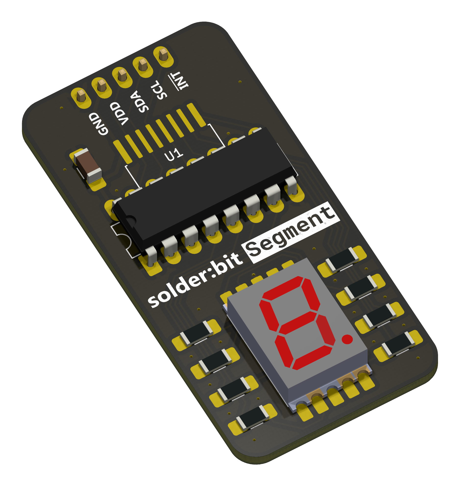
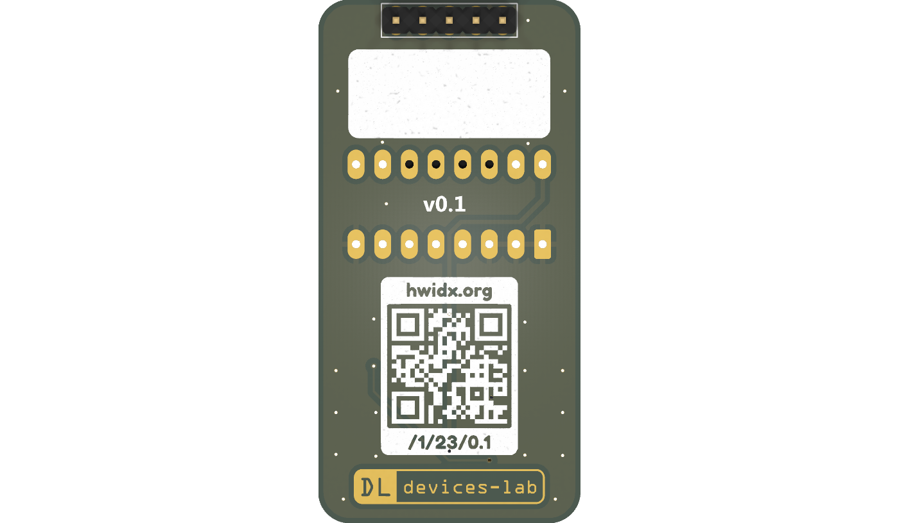

# solder:bit Segment

The solder:bit Segment is a kit for learning to solder with surface-mount (SMT) components. When assembled, the device can display a single digit on a 7-segment display. It works with any microcontroller that communicates over the [I²C protocol](https://en.wikipedia.org/wiki/I2C).

This soldering kit is designed to accommodate a wide range of soldering abilities. The I/O expander is available in two different packages. The PCF8574AT in the **SO-16** package is smaller and more challenging to solder, while the PCF8574N in the **DIP-16** package is larger and through-hole (THT), making it more accessible for novices. The same printed circuit board (PCB) has footprints for both packages, and you choose which component to solder based on your ability. The device functions identically regardless of which package you use. Note that once you have soldered one package, the footprint for the other will no longer be accessible.

| I/O expander in an SO-16 package (SMT) | I/O expander in a DIP-16 package (THT) |
| -------------------------------------- | -------------------------------------- |
|            |           |

## Getting started

> [!WARNING]
> This device is a research prototype and is provided as-is. Use it at your own risk. The authors take no responsibility for any damage, injury, or loss arising from its use.

To get started, you will need the following:

1. The printed circuit boards (PCBs), which you will need to have manufactured.
2. All components listed in the bill of materials (BOM).
3. A microcontroller development board, like the BBC micro:bit.
4. All equipment and materials required for soldering.

### Printed circuit boards (PCBs)

The solder:bit Segment fabrication files are open source, so you can order the PCBs yourself!

To fabricate the PCB, use the files in the [gerbers-v0.1](/fabrication/gerbers-v0.1/) folder.

### Components

> [!NOTE]
> Most of these components are sourced from [Onecall (Farnell/CPC)](https://onecall.farnell.com/), but as they are fairly common components, alternatives can be found from other suppliers such as LCSC, DigiKey, and others.

| Reference | Quantity | Part            | Package     | Onecall order code |
| --------- | -------- | --------------- | ----------- | ------------------ |
| C1        | 1        | 1 µF \*         | 1206        | 3188966            |
| DS1       | 1        | VDMO10A0        | SMD, 10mm   | 2682705            |
| J1        | 1        | 5-pin header \* | 2.54mm, THT | 3049532            |
| R1–R8     | 8        | 150 Ω \*        | 1206        | 9240420            |
| U1        | 1        | PCF8574AT       | SO-16       | 2776146            |
| U2        | 1        | PCF8574N        | DIP-16      | 3124747            |

_\* Generic component; the order code is provided as a reference, but any equivalent component in the same package can be substituted._

Note that U1 and U2 are alternative packages for the same PCF8574 component — you only need one. You can source both and choose whichever you are more comfortable soldering.

The 7-segment display listed above has orange segments. If you would like other colours, Vishay also offers VDMR10A0 (red) and VDMG10A0 (green). Note that you might need to adjust R1-R8 resistor values to ensure the sinking current doesn't exceed 10 mA on each GPIO pin. 

Depending on how you plan to connect the solder:bit Segment to your microcontroller development board, you may also need a breadboard and some jumper cables.

## Development board

You can use a BBC micro:bit to control the solder:bit Segment. Once assembled, attach the solder:bit Segment to a breadboard, plug the micro:bit into a [breadboard adaptor](https://kitronik.co.uk/products/5664-microbit-breadboard-breakout-board), and connect it to the breadboard. Wire up GND to GND, VDD to 3V, SDA to P20, and SCL to P19. See [this image](/demo/wiring_front.jpeg) and [this image](/demo/wiring_back.jpeg) for an example of how to wire it up.

> [!CAUTION]
> The device works at a supply voltage (VDD) from 2.5V to 6V.

The solder:bit Segment can also be used with other microcontroller development boards such as the [Raspberry Pi Pico](https://www.raspberrypi.com/products/raspberry-pi-pico/) or [Arduino Uno](https://store.arduino.cc/products/arduino-uno-rev3), however we currently only provide programming support for the micro:bit.

See the [programming](#programming) section below for how to write code to control the solder:bit Segment.

### Equipment and materials for soldering

The required equipment will vary depending on your soldering setup and needs, but the following is what you will generally need:

- Safety goggles
- Fume extractor fan
- Soldering iron
- Soldering iron stand
- Brass wool
- Silicone mat
- Solder
- Tweezers
- Solder wick

The following items are optional but useful:

- Blue Tack (for keeping the PCB in place)
- PCB holder/helping hands
- Flux
- Tip cleaner
- Desoldering pump
- Isopropyl alcohol (IPA) and cotton swabs
- Multimeter (for checking continuity in solder joints)

> [!CAUTION]
> To minimise health hazards, we recommend using lead-free and rosin-free solder and flux.

> [!TIP]
> If you are running this as a workshop/event activity, an [HDMI digital microscope](https://www.amazon.co.uk/dp/B09VPPS96M) connected to a display is very useful for streaming a soldering demonstration to the entire room.

> [!TIP]
> Smaller soldering iron tips make it easier to reach tight spaces, but they transfer heat less effectively. We recommend trying out a few different tip sizes and choosing one that works well with your soldering iron.

## Assembly instructions

Coming soon...

## Programming

If you are using a BBC micro:bit, you can program the solder:bit Segment in [MakeCode](https://makecode.microbit.org/) using the [pxt-solderbit-segment](https://github.com/devices-lab/pxt-solderbit-segment) extension.

You can test if your assembled device works by flashing the micro:bit with the [demo file](/demo/microbit-solderbit-segment-demo.hex). Attach the solder:bit Segment to a breadboard, insert the micro:bit into a [breadboard adaptor](https://kitronik.co.uk/products/5664-microbit-breadboard-breakout-board), and plug it into the breadboard. With jumper cables, wire up GND to GND, VDD to 3V, SDA to P20, and SCL to P19. See [this image](/demo/wiring_front.jpeg) and [this image](/demo/wiring_back.jpeg) for an example.

For any other development board, you will need to write the firmware yourself. Refer to the [solder:bit Segment schematic](/reference/solderbit%20Segment%20v0.1%20schematic.pdf), the datasheets for the I/O expanders (both packages), and the 7-segment display datasheet, all of which are available in the [reference](/reference/) folder.

> [!WARNING]
> The two I/O expander packages have different I²C addresses. With the current PCB layout and configuration, the PCF8574AT (SO-16 package) has an I²C address of `0x38`, while the PCF8574N (DIP-16 package) has an address of `0x20`. When writing your own firmware, make sure you are using the correct address for the package you have soldered. The [pxt-solderbit-segment](https://github.com/devices-lab/pxt-solderbit-segment) MakeCode extension handles this for you.

## Project status and contributing

This project is actively maintained. See [CHANGELOG.md](/CHANGELOG.md) for the latest changes.

At this time, external contributions are not being accepted. If you have suggestions or have found an issue, feel free to open a GitHub issue and we will take a look.

## Contact

If you are interested in using solder:bit kits for your classroom, university, conference, or any other workshop or event, feel free to reach out to me @mac-aron or email Devices Lab at [device-lab@lancaster.ac.uk](mailto:device-lab@lancaster.ac.uk).

## Acknowledgements

Special thanks to everyone at the [Devices Lab](https://www.devices-lab.org/) for their ongoing support on this project and for their help running soldering workshops.

## License

This project is licensed under the GNU General Public License (GPL), version 3. This license allows you to use, modify, and redistribute the solder:bit Segment and any derivative works, but all such derivatives must also be licensed under the GPL.

The GPL ensures that all modifications and improvements to the solder:bit Segment remain free and open for the public benefit. By using this project, you agree to abide by its terms and conditions.

For more details on the license, please see the [LICENSE](/LICENSE) file included in this repository.

